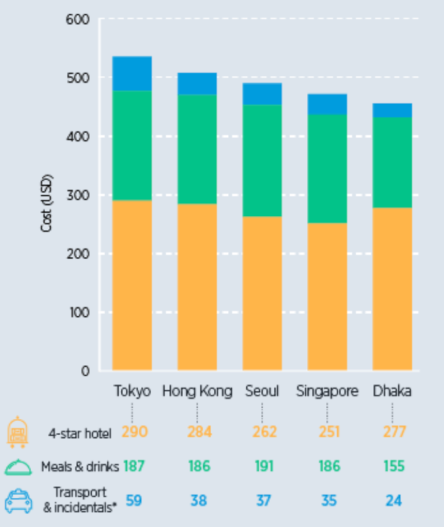

## SECTION 1 : PROJECT TITLE
## Business Traveler

---

## SECTION 2 : EXECUTIVE SUMMARY
According to statistics, the cost of business trip expenditure accounts for about 28% of the total corporate expenditure, and has become the second largest controllable cost of an enterprise. The following graph shows the business trip cost one day in top5 expensive Asia city, as we can see , hotel cost has occupied a significant part(over 50%) among all the main business trip costs like hotel meals and transportation. As a result, the primary task for business trip process and cost optimization is to optimize the process and management for the internal business trip hotel booking for an enterprise.

 *Fig 1-1: Business Trip Cost composition in major Asia Cities*

 Nowadays, there are three main types of business trip hotel booking process in different companies according to their different scale and business trip management of an enterprise. 

Firstly, for most of the large company , with adequate budget in business trip management system/ platform, the employee can search and book hotel directly by their own through internal business trip management system/platform. employees don’t need to advance payment for their business trip expense, therefore the financial process is also optimized by reducing the reimbursement processing and invoice processing. In addition such big company usually have signed cooperation agreement with travel agent so that they can get a discount on the price.

 However for many SME, without enough budget and human resources to implement and maintain a business trip management system/platform, will adopt the following methods to do hotel booking management for employees. One method is employee do advance payment by themselves when booking business trip hotel, then claim reimbursable expense on invoice to the finance, thus the employee get the reimbursement. Another one is booking business trip hotel through internal booking operator. Employees who are going for a business trip will provide his/her hotel reservation information to the booking operator, then booking operator will find out target hotel booking information, send back structured booking information to the requester, finally make a reservation for the hotel  after the booking request is approved and confirmed.

 The pros of the last process is employee don’t need to do advance payment for hotel booking, which can simplify the finance reimbursement process. While the cons is the booking operator need handling large quantities of booking request, reading hundreds of emails, collecting and arranging booking information manually, which are high frequency and repetitive tasks. Manually performing this work is prone to inefficiency and errors.

 Our project team is dedicated in assisting booking operator get rid of the monotonous repetitive task and improving the efficiency and accuracy for the hotel booking process . The solution called Business Traveler – Hotel Booking Agent, introducing robotic process automation(RPA) to process extracting semi-structured data from email, collecting and formatting data into csv file, searching hotel information via different travel agents, comparing the price and writing email for booking confirmation. What’s more, we further use google natural language process API to do name entity recognition from the email text to improve the accuracy of information extraction. 

In this solution, we use RPA to process these high frequency and repetitive tasks, significantly improve work efficiency of booking operator, and by comparing hotel prices among different travel agent we can get a relatively favorable price, further reduce the business trip cost. 

---

## SECTION 3 : CREDITS / PROJECT CONTRIBUTION

| Official Full Name  | Student ID (MTech Applicable)  | Work Items (Who Did What) | Email (Optional) |
| :------------ |:---------------:| :-----| :-----|
| Li Jiayi |          *A0215492*E          | • Data preprocessing after extracting information from business travelers' email application • Use web automation to crawl hotel information according to travel needs of business travelers • RPA Development – develop RPA2- Compare Hotel Price in different Travel Agents • Provide Travel Agent URL and hotel information that offer the most favorable price for different Travelers. • Integrate all the lowest hotel price information provided according to different needs into one Excel form for use in subsequent work automation processes • Project report writing – RPA2, Challenge & Recommendation | caowen@u.nus.edu |
| Lin Xi | A0215403W | • Project idea generation • Product prototype design – product solution, business flow design • System architecture design – system/data flow design, system modules design, database structure design • RPA Development  – develop RPA1- Email Automation, data structured automation • Cloud AI Development – Implement google natural language process API • Project management  • Debug & troubleshooting • Project report writing – Executive Summary, Business Process Solution, RPA1 | linxi@u.nus.edu |
| Zuo Zhen | *A0215464H* | System construction implement UI design & UI implement System  control logic build implement of RPA3 for sending email  User guide construction System integration System test | e053335554@u.nus.edu |

---

## SECTION 4 : VIDEO OF SYSTEM MODELLING & USE CASE DEMO

---

## SECTION 5 : USER GUIDE

`Refer to appendix <Installation & User Guide> in project report at Github Folder: ProjectReport`

### To run the system in other/local machine (windows):
#### Requirements

> Enter folder
>
> $ cd SystemCode/
>
> Install dependencies
>
> $ pip install -r requirements.txt
>
> $ pip install --upgrade google-cloud-language
>
> run r&ser.exe
>
> $ click "r&ser.exe"

## SECTION 6 : PROJECT REPORT / PAPER

`Refer to project report at Github Folder: ProjectReport`

**Sections for Project Report**

- Executive Summary
- Project Description
  - Project Objective
  - Team Members
- Project Solution
  - Business Process Solution
    - As Is Process
    - To Be Process
  - System Architecture
- Project Implementation
  - User Interface
  - Robotic Process Automation
    - RPA1 Extract Structured Booking Info from Email
    - RPA2 Compare Hotel Price in different Travel Agents
    - RPA3 Send Confirmation Email to Requestor

  * Google Natural Language Process API
- Performance & Validation
- Challenge & Recommendation
  - Challenges
    - Data Acquisition via Web Automation
    - Reaching out to the Business Companies
  - Future Improvements
    - Optimize the screening process
- APPENDIX OF REPORT

---
## SECTION 7 : Miscellaneous

`Refer to Github Folder: Miscellaneous`

---

**Lecturer: [GU Zhan (Sam)](https://www.iss.nus.edu.sg/about-us/staff/detail/201/GU%20Zhan "GU Zhan (Sam)")**

**zhan.gu@nus.edu.sg**

